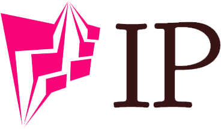

<p align="center">
  <p align="center">
    
  </p>
  
  <p align="center">
    <b>Get Public IP Address</b>
  </p>
  
  <p align="center">
    
    
    
  </p>
</p>

## Install
```bash
$ go get github.com/xjh22222228/ip
```

## Usage
```go
package main
import (
    "fmt"
    "github.com/xjh22222228/ip"
)

func main()  {
    ipv4, err := ip.V4()
    ipv6, err2 := ip.V6()

	if err != nil {
		fmt.Println( err)
	} else {
		// 98.207.254.136
		fmt.Println(ipv4)
	}

	if err2 != nil {
		fmt.Println( err2)
	} else {
		// 2a00:1450:400f:80d::200e
		fmt.Println(ipv6)
	}  
}
```
